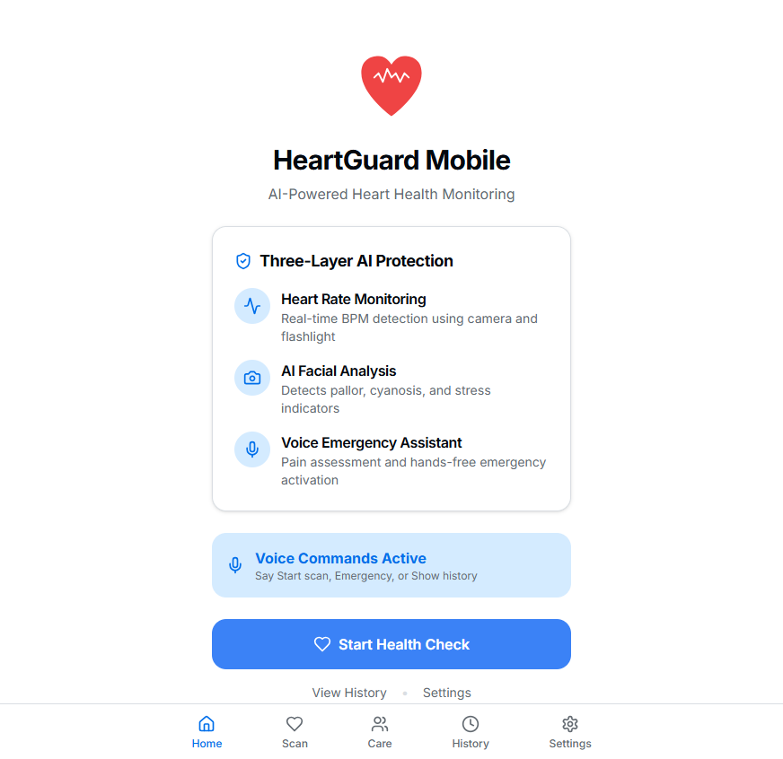
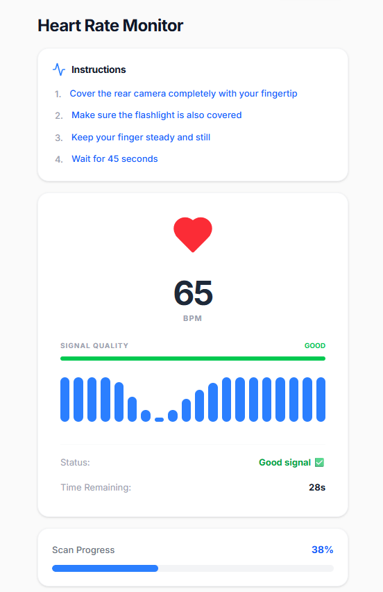
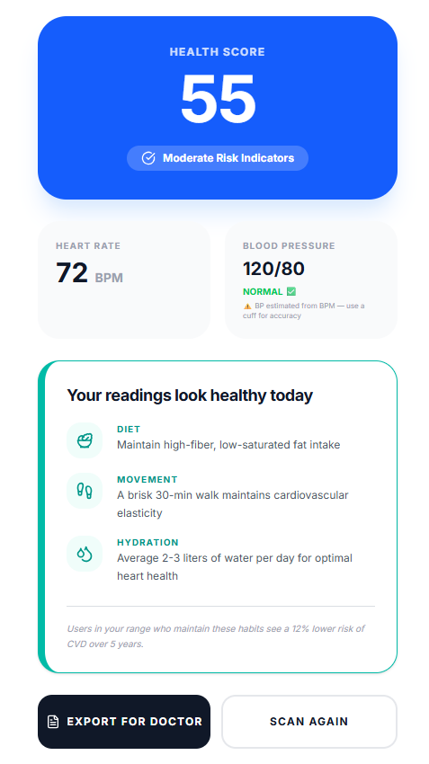
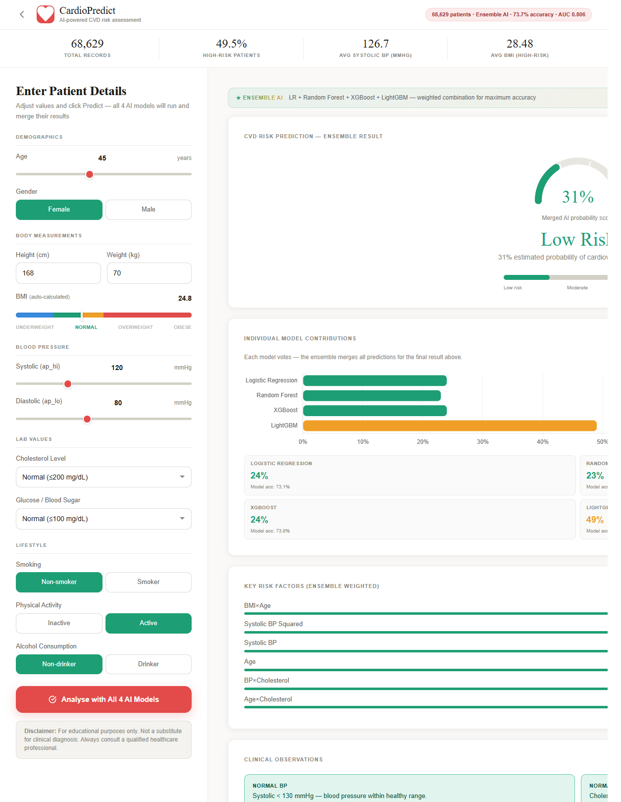

# ❤️ HeartGuard – AI-Powered Cardiovascular Risk Prediction

HeartGuard is an AI-powered web application that predicts the risk of cardiovascular disease using machine learning algorithms. The application provides an interactive interface for users to enter health parameters, receive predictions, and monitor heart health.

## 🌐 Live Demo

- **Frontend:** https://heartguard-olive.vercel.app/#/
- **Backend:** https://heartguard-9zy9.onrender.com

---

## 📌 Features

- ❤️ AI-based Heart Disease Risk Prediction
- 📊 Health Score Calculation
- 📈 Risk Probability Analysis
- 🤖 Ensemble Machine Learning Model
- 💓 Active Heart Scan Interface
- 📋 Prediction History
- ⚙️ User Settings
- 📱 Responsive User Interface

---

## 🧠 Machine Learning Models Used

The prediction system uses an ensemble of multiple machine learning algorithms:

- Logistic Regression
- Random Forest
- XGBoost
- LightGBM

The final prediction is generated by combining the outputs of all models to improve prediction accuracy.

---

## 🛠️ Tech Stack

### Frontend
- React
- TypeScript
- Vite
- Tailwind CSS
- React Router
- TanStack Query

### Backend
- Node.js
- Express.js

### Machine Learning
- Python
- Scikit-learn
- Logistic Regression
- Random Forest
- XGBoost
- LightGBM

---

## 📂 Project Structure

```
heartguard/
│
├── client/
│   ├── src/
│   ├── public/
│   └── package.json
│
├── server/
│   ├── index.js
│   └── package.json
│
└── README.md
```

---

## 🚀 Installation

### Clone the Repository

```bash
git clone https://github.com/JatinDaka/heartguard.git
cd heartguard
```

### Install Frontend

```bash
cd client
npm install
npm run dev
```

### Install Backend

```bash
cd ../server
npm install
npm start
```

---

## 📊 Input Parameters

The model predicts cardiovascular disease risk using health-related parameters such as:

- Age
- BMI
- Gender
- Cholesterol Level
- Glucose Level
- Smoking Status
- Physical Activity
- Systolic Blood Pressure
- Diastolic Blood Pressure
- Alcohol Consumption

---

## 📈 Output

The application provides:

- Cardiovascular Disease Risk (%)
- Health Score
- AI Confidence Score
- Model-wise Prediction Breakdown

---

## 📸 Screenshots

### Home Page



### Active Scan



### Prediction



### Results



---

## 🎯 Future Improvements

- User Authentication
- Cloud Database Integration
- Patient Report Generation
- Doctor Dashboard
- Real-time Health Monitoring
- Wearable Device Integration

---

## 👨‍💻 Developed By

**Jatin Daka**

B.Tech Computer Engineering

---

## 📄 License

This project is developed for educational and research purposes.
